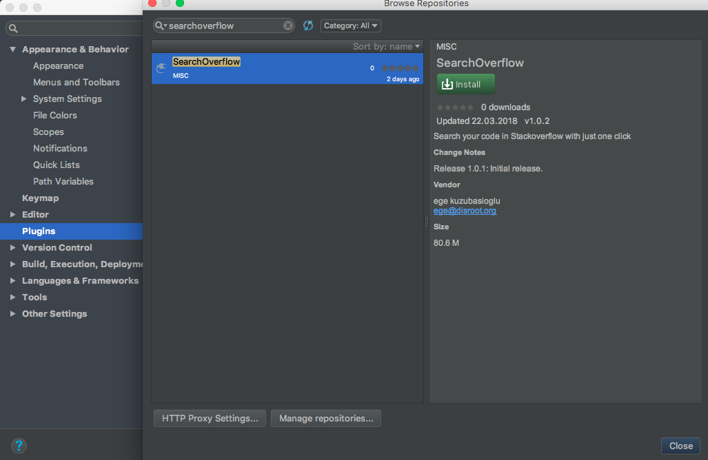

# SearchOverflow

[IntelliJ](https://www.jetbrains.com/products.html) Platform plugin for searching code snippets, keywords or errors on
[Stackoverflow](http://www.stackoverflow.com/) with just a click.

## How to install

ALWAYS USE THE STABLE AND LATEST VERSION OF THIS PLUGIN, IF THERE IS A VERSION WAITING FOR UPDATE JUST WAIT.
It is tested in IntelliJ IDEA and Android Studio, might be unstable in other Jetbrains platforms such as PyCharm. 
In which case [report issues](https://github.com/egek92/SearchOverflow-IntelliJ/issues).

- in Android Studio or any other IntelliJ IDE: go to `Preferences → Plugins → Browse repositories` and search for `SearchOverflow`



_or_

- [download it](https://plugins.jetbrains.com/plugin/10551-searchoverflow) and install via `Preferences → Plugins → Install plugin from disk`


## How to use it


 1. Make sure you have latest version of your IDE
 2. Select the text, code snippet or error message and right-click
 4. Select "Search on Stackoverflow"

## Contributing

Pull requests are welcomed!

I'm planning to add more features like sub-menus for advanced search


- Using [actions sytem](https://www.jetbrains.org/intellij/sdk/docs/basics/action_system.html), make 2 sub-menus `search in questions`, `search in title`.
- Stackoverflow uses `is:question` and `is:title` query tags for this.


- make sure you stick to clean coding and Java naming conventions.
- follow [Getting Started with Plugin Development](http://confluence.jetbrains.com/display/IDEADEV/Getting+Started+with+Plugin+Development)
- make sure you have Java 8 installed if you want to publish it in the plugin repository

## LICENCE

```
               MIT LICENCE
               
Copyright (c) 2018 Ege Kuzubasioglu


Permission is hereby granted, free of charge, to any person obtaining a copy
of this software and associated documentation files (the "Software"), to deal
in the Software without restriction, including without limitation the rights
to use, copy, modify, merge, publish, distribute, sublicense, and/or sell
copies of the Software, and to permit persons to whom the Software is
furnished to do so, subject to the following conditions:


The above copyright notice and this permission notice shall be included in all
copies or substantial portions of the Software.


THE SOFTWARE IS PROVIDED "AS IS", WITHOUT WARRANTY OF ANY KIND, EXPRESS OR
IMPLIED, INCLUDING BUT NOT LIMITED TO THE WARRANTIES OF MERCHANTABILITY,
FITNESS FOR A PARTICULAR PURPOSE AND NONINFRINGEMENT. IN NO EVENT SHALL THE
AUTHORS OR COPYRIGHT HOLDERS BE LIABLE FOR ANY CLAIM, DAMAGES OR OTHER
LIABILITY, WHETHER IN AN ACTION OF CONTRACT, TORT OR OTHERWISE, ARISING FROM,
OUT OF OR IN CONNECTION WITH THE SOFTWARE OR THE USE OR OTHER DEALINGS IN THE
SOFTWARE.
```


